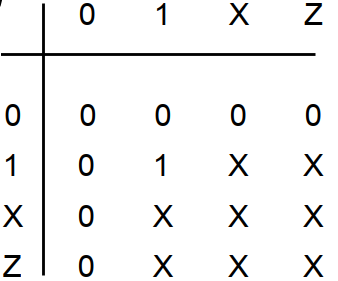
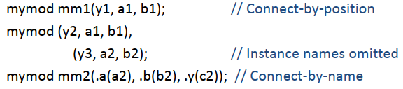
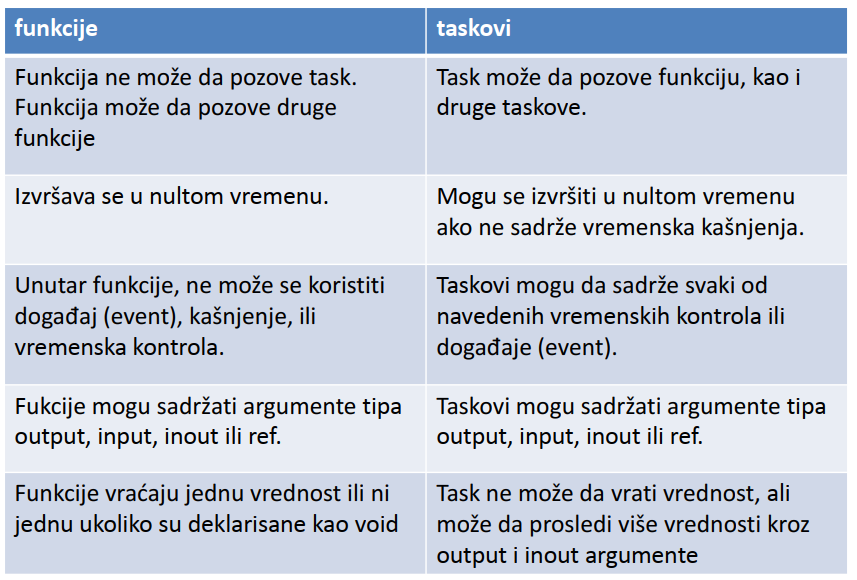
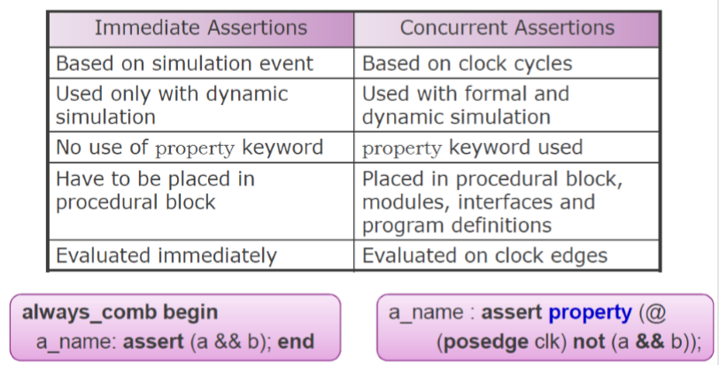

```text
Univerzitet u Novom Sadu
Fakultet tehničkih nauka
Računarska tehnika i računarske komunikacije
```

## Projektovanje namenskih računarskih struktura 2

### VHDL

* Lečevi (eng. Latch) − transparentna kola, kod kojih je moguće menjati stanje u proizvoljnom vremenskom trenutku.
* Flipflopovi − sinhrona kola, kod kojih je moguće menjati stanje samo u trenucima kada to dozvoljava stanje na tzv. taktnom ulazu; upis se vrči na odgovarajuću promenu nivoa takt signala.
* Multiple Driver - Kada dva različita procesa hoće istom signalu da dodele vrednost

### Verilog

* 4 vrednosti
   * `0`, `1` - osnovne binarne vrednosti
   * `Z` - izlaz neaktivnog drivera, niko ne drajvuje wire signal
   * `X` - simulator ne može da odluži vrednost, inicijalno stanje registra, modeluje koliziju
* 
* Instanciranje modula 
* Initial blok - izvršava se na početku simulacije, završava se kada kontrola stigne do kraja, pogodno za formiranje stimulusa
* Always blok - pokreće se pri pokretanju simulacije, restartuje se čim kontrola stigne do kraja, pogodno za modelovanje hardvera
* Vremenski okviri simulacije
   * `#1` - jedan trenutak vremena, definisan kroz timescale
   * `#1step` - jedan period takta
   * `#1us` - eksplicitno 1 mikrosekunda
* Dodela vrednosti
   * Blokirajuća `a = 1`, b = a, c = b, dff` (redno povezani)
   * Ne blokirajuća `a <= 1, b <= a, c <= b, wires` (flip-flop/registri iz jednog u drugi)

### SystemVerilog

* Povezivanje modula
   * Poziciono konektovanje - `alu alu_inst (top_alu_out, , top_ain, top_bin, top_opcode);`
   * Konektovanje po imenu - `alu alu_inst (.alu_out(top_alu_out), .zero(), .ain(top_ain, .bin(top_bin), .opcode(top_opcode));`
   * Implicitne .name konekcije - `alu alu_inst (.alu_out, .zero(), .ain, .bin, .opcode);`
   * Implicitne `.*` konektice - `alu alu_inst (.*, .zero()); ` 
* Fork/join - izvršava sve procese konkurentno
   * Fork...join - svi procesi se odvijaju konkurentno, čeka se da svi završe
   * Fork...join_any - čeka se završetak najbržeg, ostali nastavljaju da se odvijaju
   * Fork...join_none - konstrukcija se izvršava trenutno, svi nastavljaju da se izvršavaju
* Begin/end - procese izvršava sekvencijalno, jedan za drugim
* Pošto je neophodno u SW modelovati paralelizam HW, nedovoljna je samo jedna dimenzija vremena "t" (simulaciono vreme – simulation time) dodaje se još jedna dimenzija "vreme događaja" – event time
   * u svakom koraku simulacionog vremena završavaju se sve simulacione aktivnosti vremena događaja koje teče iz te tačke
* Task može imati vremensko kašnjenje i nema povretnu vrednost, izlaz se definiše na drugačiji način, za razliku od funkcije
* Prosleđivanje parametara je moguće po vrednosti i po referenci
* 
* Interfejsi omogućavaju efikasno povezivanje između blokova velikih kompleksnih digitalnih sistema
   * Nasleđuju se kao jedan blok
   * Kapsulira struktuiran tok podataka/kontrola između blokova
* Interfejs ne specificira vremenske karakteristike, sinhornoizaciju, takt
* Clocking blok - definiše tajming u donosu na dati takt, sinhronizacija događaja, smicnje
   * Pomaže da se izbegne trka do podataka
   * Mogu se instancirati u interfejs
   * Implementira se kao "clocking" gde imamo `input #1, output #2`
      * `input #1` // opredeljuje trenutak semplovanja ulaznog signala u odnosu na referentnu ivicu takta (u ovom slučaju to je 1 time unit), pre ivice za 1
      * `output #2` // opredeljuje trenutak postavljanja izlaznog isgnala u odnosnu na referentnu ivicu takta (u ovom slučaju to je 2 time unita), posle ivice za 2
      * Pošto opisuje odstupanje od referentne ivice takta, ime mu je `skew` (nesigurnost, smicanje)
* Queue je kolekcija složenih homogenih elemenata
* Značaj Queue kao naprednije objektne tehnike u odnosu na nizove, zašto nam je to potrebno? 
   * Zbog transakcija kao apstraktnih objekata koje ćemo prometati kroz Queue
* Zašto OOP?
   * Veća produktivnost
   * Ogranizacija koda
   * Virtuelne klase i metode
* Nasleđivanje podrazumeva način izvođenja nove klase korišćenjem postojeće klase
* Nasleđivanje pomaže u ponovnom korišćenju postojećeg koda (code reuse)
* Izvedene klase nasleđuju atribute i ponašanje klasa prethodnika
* Virtualna klasa i virtualne članice su prototipovi
* Izvedene klase nasleđuju sve članice iz virtualne klase
* Polimorfizam - Sposobnost da se iste operacije izvedu na više različitih tipova stvari

### SystemVerilog, Assertions

* Assertion predstavlja logičku tvrdnju postavljenu unutar DUT-a ili spolja u njegovom okruženju koja verifikuje DUT
* Kod za verifikaciju određene karakteristike
* Assertions se koriste da specificiraju uslove za koje programer podrazumeva da su tačni 
* Gde se koriste
   * Reaktivni testbenčevi
   * Mogu se deklarisati u SV unitima
   * Mogu se povezati sa VHDL/Verilog blokovima
* Trenutni i konkurentni 
* Trenutni se izvršavaju kao izrazi u proceduralnom bloku, interpretirani su kao if izraz, uspešno je `1`, `0-X-Z` je neuspešno
* Konkurentni opisuju ponašanje postavljeno u vremenu, inkorporiraju temporalnu logiku `@posedge`
* Sekvence omogućavaju formiranje temporalnih izraza
   * Sa fiksnim kašnjenjem, `sel ##2 enable` posle 2 ivice takta enable treba da je true
   * Kašnjenje može biti 
      * Fiksno `##1`
      * Interval `##[1:3]`
      * Otvoren internval `##[5:$]`, od 5 ciklusa do kraja simulacije
   * Sa `and` i `or` obe sekvence startuju zajedno (`Seq1 and Seq2`), poređenje kada poslednja završi
   * Preklapanje sekvenci `Seq1 intersect Seq2`
   * Sekvenca unutar sekvence `Seq1 "within" Seq2`
   * Obe startuju istovremeno, `first_match" Seq1`
   * Istinitost duž sekvence `!a throughout Seq1`
   * Iff disable reset, (`@posedge clk`) `disable iff (reset) (a |-> !b)`
   * Implikacija u istom ciklusu `|->`, ako je uzrok ispunjen, posledica se sračunava u istom ciklusu, ako nije, implikacija je po definiciji tačna bez obzira na istinitost posledice
   * Implikaciju u sledećem ciklusu `|=>`, ako je uzrok ispunjen posledica se sračunava u narednom ciklusu, ako nije, implikacija je po definiciji tačna
   * Pravi uspeh je kada su uzrok i posledica tačni, neuspeh kada je uzrok tačan a posledica netačna
* `assume` izraz dozvoljava properti-ju da budu podrazumevan i za formalnu analizu i simulaciju
   * the statement is simply assumed to be true and rest of the statements that need to be verified are constrained accordingly.

### UVM

* Osnovna ideja UVM-a obuhvata modularno razdvajanje sistemski bitnih scenarija ispitivanja od signalnog nivoa DUT-a
* UVM komponente
   * UVM Testbench tipično instancira Modul koji se testira (DUT) i UVM test klasu, takođe konfiguriše veze između njih. Testovi se pokreću u runtimeu
   * UVM Test je komponenta najvišeg nivoa unutar testbenča. Ona priprema okruženje i priprema stimuluse
   * UVM Envirement grupiše verifikacione komponente poput agenta, scoreboarda
   * UVM Scoreboard proverava ponašanje određenog DUTa. Prima vrednosti ulaza i izlaza DUTa i koristi se kao referentni model za generisanje očekivanih rezultata/stanja koje poredi sa stvarim izlazima
   * UVM Agent grupiše verifikacione komponente. Sadrži sekvencer, driver i monitor. Agent instancira i povezuje driver, monitor i sequencer koristeći TLM konekcije
      * Aktivni način rada, gde agent emulira uređaj u sistemu i pokreće DUT signale. Ovaj način rada zahteva da agent instancira driver i sequencer. Monitor se takođe instancira za proveravanje i pokrivenost.
      * Pasivni način rada, u kom agent ne instancira driver ili sekvencer i radi pasivno. Instancira se i konfiguriše samo monitor. Ovaj način rada se koristi samo ukoliko je potrebno vršiti pregled i pokrivanje
   * UVM Sekvencer koristi se kao arbiter za kontrolu toka transakcija
   * UVM Sekvenca je objekat koji sadrži algoritam za generisanje stimulusa, nasleđuje se  uvm_sequencer. Postavljanje toka podataka koje se šalju DUT-u. Postavljanje toka akcija koje se izvršavaju na DUT interfejsu.
   * UVM Drajver prima sekvence od sekvencera i iz njih formira telegrame koje šalje na DUT interfejs. Pretvara stimulus na nivou transakcije na stimulus na nivou signala (koji se povezuju na pinove čipa). Nasleđuje se uvm_driver
   * UVM Monitor sempluje DUT interfejs i preuzete informacije pretvara u transakcije koje šalje testbanchu za dalju analizu. Sličan je drajveru samo što od signalnih aktivnosti pravi transakcije. Monitor je odgovoran za ekstrakciju informacija sa magistrale i prevođenje te informacije u transakciju odnosno data item.
* UVM Simulacione faze, sve osim `run_phase` se izvršavau u nultom vremenu
   * Run faza - obezbeđuje izvršenje zadatak UVM komponenti, koristi se za definisanje stimulusa, ne možemo znati tačan red izvršavanja (run metoda je forkovana). Run faza se događa u vremenu i troši simulaciono vreme
   * Build faza - koristi se za kreiranje komponenti, unutar uvm_component klase definišemo klasu build_component, hijerarhija se grad sa vrha na dole
   * Connect faza - koristi se za kreiranje referenci i konekcija između komponenti. Za korišćenje connect faze potrebno je definisati connect_phase funkciju unutar uvm_componenta. Connect faza se zvršava kada je cela topologija izgrađena
   * Tok izvršavanja: `build` > `connect` > `run`
* UVM transakcija je objekt klase koji uključuje sve informacije koje su potrebne za modelovanje osnovne komunikacija između dve komponente. Objekt transakcije uključuju varijable, ograničenja i metode.
* Interfejsi koje smo do sada posmatrali blokiraju  izvršavanje taska dok se ne završe, ne postoji mogućnost da se prekine. Neblokirajući se odmah vraća.
* `get`, `try_get`, `put`, `try_put`, da li troše vreme
* `uvm_analysis_port` (predstavljen kao dijamant na monitoru) je specijalizovani TLM port čiji se interfejs sastoji od jedne funkcije, `write()`. analysis port može biti povezan na nulu, jedan ili više analysis export. `write() void` funkcija, poziv će uvek biti završen u istom delta ciklusu
* Svaka `write()` implementacija pravi lokalnu kopiju transakcije, a zatim radi nad kopijom da bi se izbeglo menjanje sadržaja transakcije za bilo kog drugog pratioca
* Sekvence su proširenja transakcija. Sadrže dodatne promenjive koje se koriste na drajveru i sekvenceru.
* Komponente potrebne za verifikaciju, generator stimulusa sekvencer, drajver, monitor i komponente za analizu (scoreboard i coverage) 
* Izolacija koju pruža OO tehnika i TLM interfejsi između komponenti olakšava reusability
* Globalna fabrika nam omogućava zamenu tipa unapred definisane komponente nekom drugom vrstom koja je specijalizovani za navedene namene, bez potrebe za ikakvim izmenama u kodu koji sadrži date komponente. Fabrika može da zameni komponentu unutar hijerarhije komponenti bez promene bilo koje druge komponente u hijerarhiji. `set_type_override`
* Klasa environment predstavlaj vrh hijerarhije komponenti za višekratnu upotrebu. Ona instancira i konfiguriše sve svoje podkomponente
